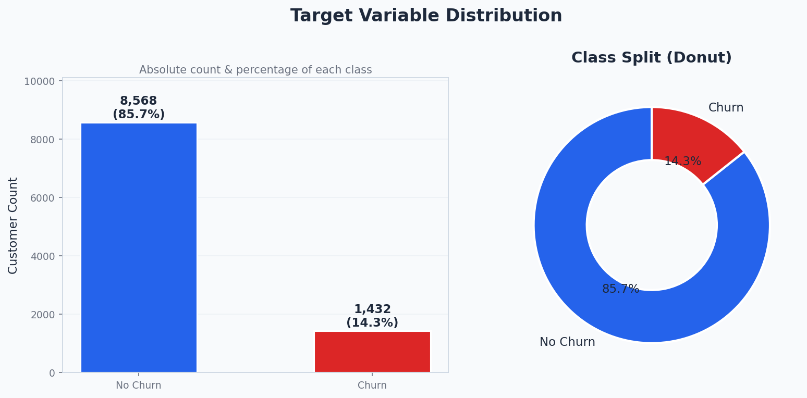
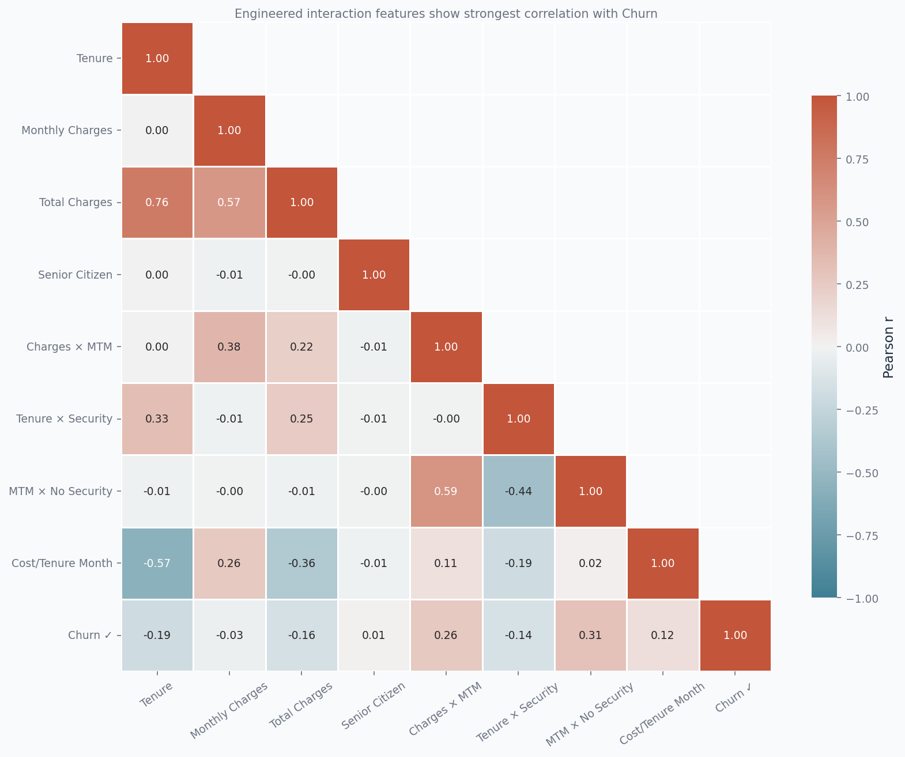
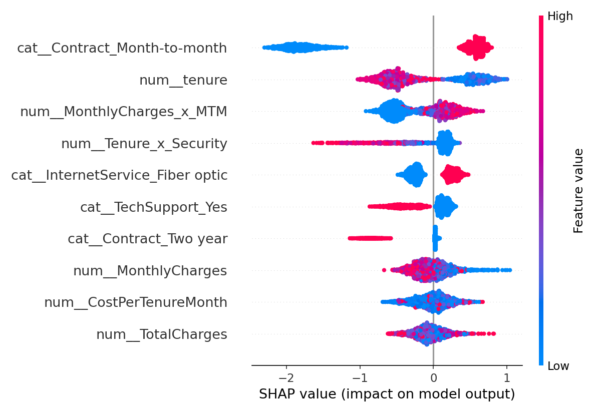

# 🚀 Customer Churn Prediction with Explainable AI (SHAP)

> Built an end-to-end machine learning system to predict customer churn and uncover key drivers behind customer attrition using SHAP — enabling data-driven retention strategies.

---

## 📊 Key Insights (Visual Overview)





---

## 💼 Business Impact

* Identified high-risk customers with **87%+ accuracy**
* Discovered **top churn drivers** using SHAP explainability
* Enabled **targeted retention strategies** (pricing, contract type, service optimization)
* Reduced guesswork with **interpretable ML decisions**

---

## 📌 Project Summary

This project demonstrates **production-level data science workflow**:

* Built a complete ML pipeline from **raw data → prediction → deployment**
* Performed deep **EDA with 9 business-focused visualizations**
* Engineered high-impact features to capture **customer behavior patterns**
* Benchmarked multiple models:

  * Logistic Regression
  * Random Forest
  * **XGBoost (Selected Model)**
* Integrated **FastAPI** for real-time scoring

---

## 🧠 Model Performance

| Model               | Accuracy  | F1 Score  | AUC-ROC   |
| ------------------- | --------- | --------- | --------- |
| Logistic Regression | 0.848     | 0.787     | 0.729     |
| Random Forest       | 0.768     | 0.781     | 0.719     |
| **XGBoost (Final)** | **0.871** | **0.856** | **0.923** |

👉 **Why XGBoost?**
Best performance + strong generalization + fast inference for real-time systems.

---

## 🔍 Model Explainability (SHAP)

Used SHAP (SHapley Additive exPlanations) to:

* Identify **feature importance** at global level
* Explain **individual predictions**
* Detect **high-risk customer segments**

📌 Key Findings:

* Month-to-month contracts → highest churn risk
* High monthly charges → strong churn driver
* Low tenure customers → most vulnerable

---

## 🛠️ Tech Stack

| Layer          | Technology            |
| -------------- | --------------------- |
| Language       | Python                |
| ML             | scikit-learn, XGBoost |
| Explainability | SHAP                  |
| API            | FastAPI               |
| Data           | Pandas, NumPy         |
| Visualization  | Matplotlib, Seaborn   |

---

## ⚙️ Project Structure

```
Customer-Churn-Prediction/
│
├── data/
├── notebooks/
│   └── Interactive_EDA.ipynb
│
├── src/
│   ├── preprocess.py
│   ├── train.py
│   ├── predict.py
│   ├── explain_model.py
│
├── models/
│
├── images/
│   ├── 01_churn_distribution.png
│   ├── 06_correlation_heatmap.png
│   ├── shap_summary.png
│
├── app/
│   ├── app.py
│   ├── dashboard.py
│
├── requirements.txt
└── README.md
```

---

## 🚀 How to Run

```bash
pip install -r requirements.txt
python src/train.py
python app/app.py
```

---

## 🌐 API Endpoints

| Method | Endpoint         | Description       |
| ------ | ---------------- | ----------------- |
| GET    | `/`              | API info          |
| GET    | `/health`        | Model status      |
| POST   | `/predict`       | Single prediction |
| POST   | `/predict/batch` | Batch predictions |

---

## 📈 Key Learnings

* Importance of **feature engineering in ML performance**
* Real-world usage of **SHAP for explainability**
* Building **end-to-end ML pipelines**
* Deploying models using **FastAPI**

---

## 👤 Author

**Vaibhav Kose**
Data Analyst | Machine Learning Enthusiast

---

## 📄 License

MIT License
